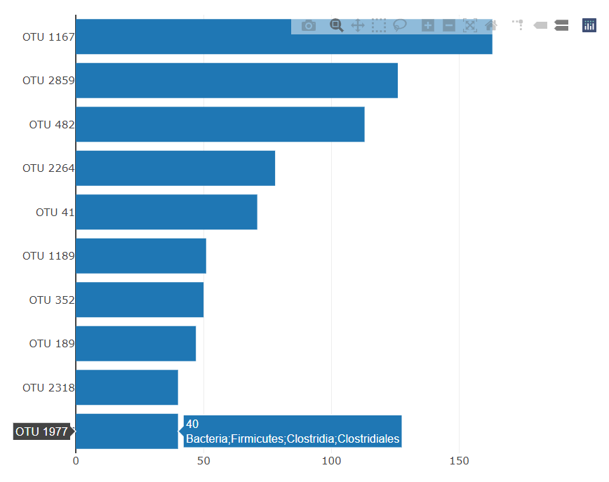
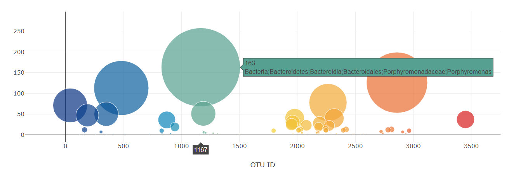

# Belly-Button-Challenge
This repository is for the Data Analytics Bootcamp Module 14 Challenge

In this assignment, I built an interactive dashboard to explore the Belly Button Biodiversity dataset, which catalogs the microbes that colonize human navels. The dataset reveals that a small handful of microbial species (also called operational taxonomic units, or OTUs, in the study) were present in more than 70% of people, while the rest were relatively rare.

## I was able to create a dropdown menu that, when changed, updated information in the following: the Demographic Info table, the bar chart, and the bubble chart: 

I referenced class activities and instruction provided by Instructor Brett Barnes and TA Ally Qi to complete this activity.
